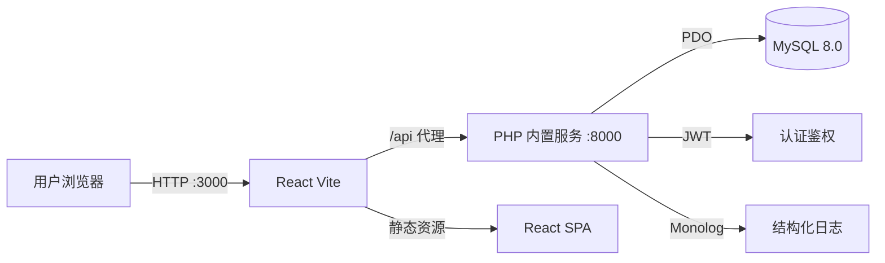
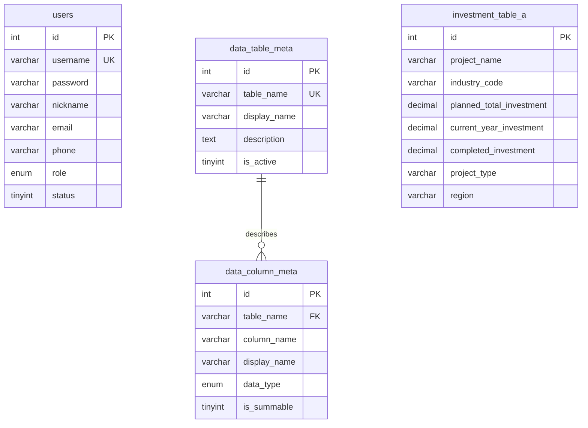

# 🚀 综合汇总系统 — DataAggregator

> **一键跨表汇总，让复杂数据分析变得简单高效**

基于多数据源的综合汇总分析平台，支持多表联合查询、条件筛选、智能聚合计算，帮助用户快速从海量投资项目数据中提取关键指标，生成专业汇总报表。

---

## 🏗️ 系统架构



**核心模块职责：**
- **Frontend (React)** — 汇总项配置、条件构建、结果展示与 Excel 导出
- **Backend (PHP)** — RESTful API、数据聚合引擎、用户认证与权限管理
- **Database (MySQL)** — 投资项目数据存储、元数据管理、用户信息持久化

---

## 💾 数据设计



| 配置项 | 值 |
|--------|-----|
| 数据库类型 | MySQL 8.0 |
| 字符集 | utf8mb4_unicode_ci |
| 持久化 | MySQL 数据目录 |
| 连接方式 | `DB_HOST`、`DB_PORT` 环境变量 |

---

## 🛠 技术栈

| 层级 | 技术 |
|------|------|
| **Frontend** | React 18 + Vite + TailwindCSS + Zustand + Axios |
| **Backend** | PHP 8.2 + Apache + Monolog + Firebase JWT |
| **Database** | MySQL 8.0 (utf8mb4) |
| **Infra** | Vite 开发代理 + PHP 内置服务 |
| **导出** | SheetJS (XLSX) 前端本地导出 |

---

## 🚀 本地快速启动

1. 准备 PHP 8.2、Composer、Node.js 20 和 MySQL 8.0
2. 创建数据库并导入 `database/init.sql`
3. 安装后端依赖：`cd backend && composer install`
4. 安装前端依赖：`cd frontend && npm ci`
5. 启动后端：`cd backend && php seed.php && php -S 0.0.0.0:8000 -t public`
6. 启动前端：`cd frontend && npm run dev -- --host 0.0.0.0`

## 🔗 服务地址

| 服务 | 地址 |
|------|------|
| 前端 | http://localhost:3000 |
| 后端 API | http://localhost:8000/api |
| 数据库 | localhost:3306 |

## 🧪 测试账号

- 用户名：`admin`
- 密码：`123456`

---

## 📷 核心功能

### 1. 综合汇总（核心功能）
**三步式操作流程：**
- **步骤一**：添加汇总项 — 配置名称、选择数据表、选择汇总列
- **步骤二**：配置条件 — 可选筛选条件（等于/大于/小于/包含等），支持且/或逻辑
- **步骤三**：一键生成 — 后端聚合计算，前端表格展示，支持 Excel 导出

### 2. 数据浏览
- 切换查看各投资数据表的原始数据
- 分页加载，单元格复制

### 3. 用户管理（管理员）
- 用户列表、编辑角色/状态、删除用户
- 管理员不可修改自身角色和状态（防止业务 bug）

### 4. 个人中心
- 修改昵称、邮箱、手机号（带格式校验）
- 修改密码（验证原密码）
- 数据一致性同步（个人中心或用户管理修改后，右上角等全局展示实时更新）

---

## 🗂 项目结构

```
label-3448/
├── README.md                    # 项目文档
├── database/
│   └── init.sql                 # 数据库初始化 + 种子数据
├── backend/                     # PHP 后端
│   ├── composer.json
│   ├── seed.php                 # 管理员密码运行时修复
│   ├── public/
│   │   ├── index.php            # 入口文件
│   │   └── .htaccess            # URL 重写 + Authorization 头透传
│   └── src/
│       ├── Core/                # 核心框架（App/Router/Database/Logger/Auth/Response/Validator）
│       ├── Controllers/         # 控制器（Auth/Table/Summary/User）
│       └── Middleware/          # 中间件（JWT 认证）
└── frontend/                    # React 前端
    ├── package.json
    └── src/
        ├── api/                 # HTTP 请求封装 + 拦截器
        ├── stores/              # Zustand 状态管理
        ├── components/          # 通用组件（Layout/ConfirmModal/SummaryItemModal/ResultTable）
        └── pages/               # 页面（Login/Register/Summary/DataView/Profile/UserManagement）
```

---

## 🔑 关键实现路径

```
1. 数据库设计与种子填充 → 2. PHP RESTful API 框架搭建 → 3. 用户认证与权限体系
→ 4. 数据表/列元数据动态加载 → 5. 汇总引擎（条件解析 + SQL 聚合）
→ 6. React 前端三步式汇总交互 → 7. Excel 本地导出 → 8. 本地开发代理联调
```

---

## 🔧 专业工程实践

### 1. 日志系统
- 使用 **Monolog** 标准日志库，输出到 `stdout/stderr`
- 结构化日志包含时间戳、级别、模块信息
- 后端日志输出到标准输出，便于本地终端和进程管理工具收集

### 2. 错误处理
- **前端**：Axios 拦截器统一处理，消息去重（2s 内不重复），业务错误标记
- **后端**：全局异常捕获，统一 `{code, message, data}` 响应格式
- 401 自动跳转登录页，无原生 alert/confirm 弹窗

### 3. 数据校验
- **前端**：表单必填校验、邮箱/手机号格式验证（空值可提交、有值必合法）
- **后端**：Validator 类严格校验输入，SQL 参数化查询防注入

### 4. 接口设计
- RESTful 风格，统一响应格式 `{code: 200, message: "...", data: {...}}`
- JWT Bearer Token 认证，CORS 跨域支持
- 分页接口统一 `{items, total, page, pageSize, totalPages}`

### 5. 生产级特性清单

| 维度 | 状态 | 说明 |
|------|------|------|
| 响应式布局 | ✅ | TailwindCSS 响应式 + 侧边栏折叠 |
| 数据持久化 | ✅ | Docker Volume 持久化 MySQL 数据 |
| 模块化架构 | ✅ | 前后端分层清晰，PSR-4 自动加载 |
| 中文不乱码 | ✅ | utf8mb4 全链路配置 |
| 密码安全 | ✅ | BCrypt 哈希，运行时密码修复 |
| 权限控制 | ✅ | 管理员/普通用户角色区分 |
| 本地联调 | ✅ | Vite 代理后端 API，前后端可独立启动 |
| 环境配置 | ✅ | 数据库和 JWT 参数由环境变量控制 |
| 交互反馈 | ✅ | 加载态、hover、Toast 通知 |
| 数据一致性 | ✅ | 修改后全局同步更新 |
